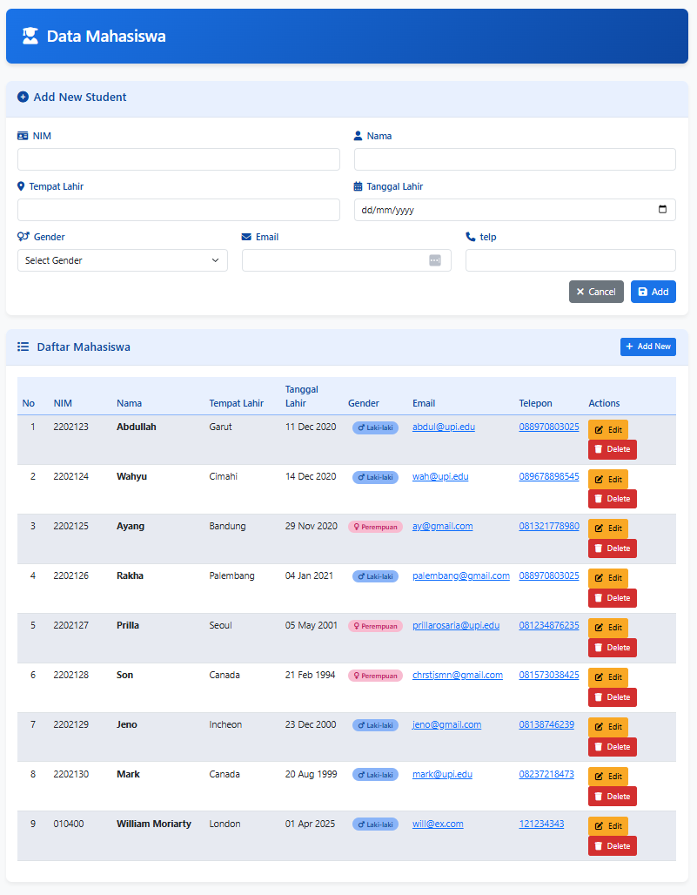

# Janji
Saya Yusrilia Hidayanti dengan NIM 2306828 mengerjakan Tugas Praktikum 8 dalam mata kuliah Desain dan Pemrograman Berorientasi Objek untuk keberkahanNya maka saya tidak melakukan kecurangan seperti yang telah dispesifikasikan. Aamiin.

# Desain Program
Sistem manajemen data mahasiswa berbasis web dengan arsitektur MVP (Model-View-Presenter) 


1. **Model**: Bertanggung jawab untuk mengelola data dan interaksi dengan database.
   - `DB.class.php`: Kelas dasar untuk koneksi database
   - `Mahasiswa.class.php`: Representasi objek mahasiswa
   - `TabelMahasiswa.class.php`: Operasi CRUD untuk tabel mahasiswa

2. **View**: Bertanggung jawab untuk menampilkan data kepada pengguna.
   - `TampilMahasiswa.php`: Menampilkan data mahasiswa dan form CRUD
   - `Template.class.php`: Mengelola template HTML

3. **Presenter**: Bertindak sebagai perantara antara Model dan View.
   - `ProsesMahasiswa.php`: Memproses data dari Model untuk ditampilkan di View
   - `KontrakPresenter.php`: Interface yang mendefinisikan kontrak Presenter

### Struktur File

```
├── index.php                  # Entry point aplikasi
├── model/
│   ├── DB.class.php           # Kelas koneksi database
│   ├── Mahasiswa.class.php    # Kelas model mahasiswa
│   ├── TabelMahasiswa.class.php # Kelas operasi tabel mahasiswa
│   └── Template.class.php     # Kelas template
├── presenter/
│   ├── KontrakPresenter.php   # Interface presenter
│   └── ProsesMahasiswa.php    # Implementasi presenter
├── view/
│   ├── KontrakView.php        # Interface view
│   └── TampilMahasiswa.php    # Implementasi view
└── templates/
    └── skin.html              # Template HTML
```
# Penjelasan Alur
### Alur Umum

1. User mengakses `index.php`
2. `index.php` membuat instance `TampilMahasiswa`
3. `TampilMahasiswa` membuat instance `ProsesMahasiswa`
4. `ProsesMahasiswa` mengambil data dari database melalui `TabelMahasiswa`
5. Data ditampilkan ke user melalui template HTML

### Alur CRUD

#### Create (Tambah Data)
1. User mengisi form tambah data dan submit
2. `TampilMahasiswa` menangkap data form
3. Data diteruskan ke `ProsesMahasiswa`
4. `ProsesMahasiswa` memanggil method `addMahasiswa` di `TabelMahasiswa`
5. Data disimpan ke database
6. User diarahkan kembali ke halaman utama

#### Read (Baca Data)
1. `ProsesMahasiswa` memanggil method `getMahasiswa` di `TabelMahasiswa`
2. Data diambil dari database
3. Data dikonversi menjadi objek `Mahasiswa`
4. Data ditampilkan dalam tabel di halaman utama

#### Update (Edit Data)
1. User mengklik tombol Edit pada data yang ingin diubah
2. Form edit ditampilkan dengan data yang sudah ada
3. User mengubah data dan submit
4. `TampilMahasiswa` menangkap data form
5. Data diteruskan ke `ProsesMahasiswa`
6. `ProsesMahasiswa` memanggil method `updateMahasiswa` di `TabelMahasiswa`
7. Data diupdate di database
8. User diarahkan kembali ke halaman utama

#### Delete (Hapus Data)
1. User mengklik tombol Delete pada data yang ingin dihapus
2. Konfirmasi penghapusan ditampilkan
3. Jika user mengkonfirmasi, `TampilMahasiswa` menangkap ID data
4. ID diteruskan ke `ProsesMahasiswa`
5. `ProsesMahasiswa` memanggil method `deleteMahasiswa` di `TabelMahasiswa`
6. Data dihapus dari database
7. User diarahkan kembali ke halaman utama


# Dokumentasi
